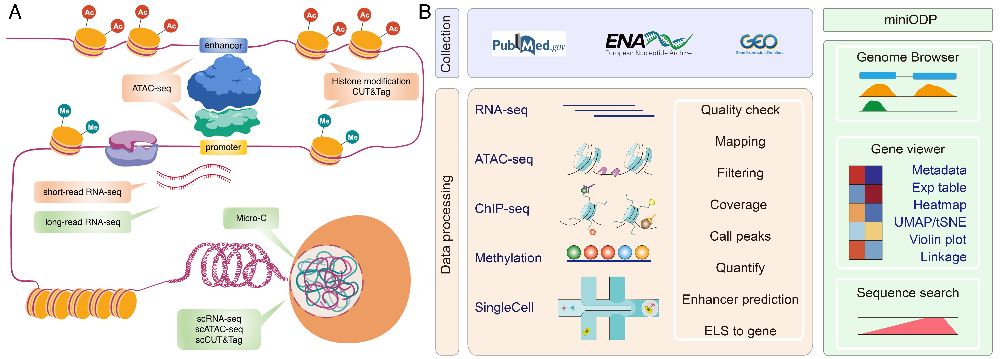
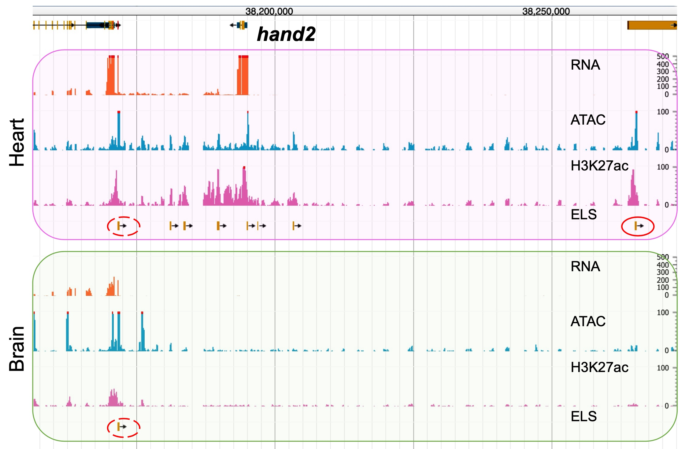
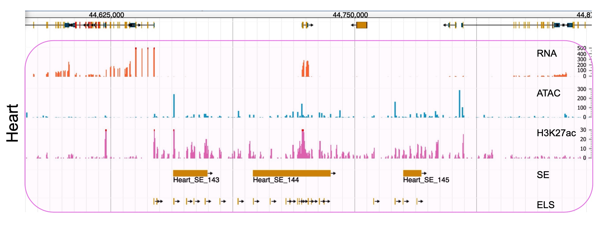
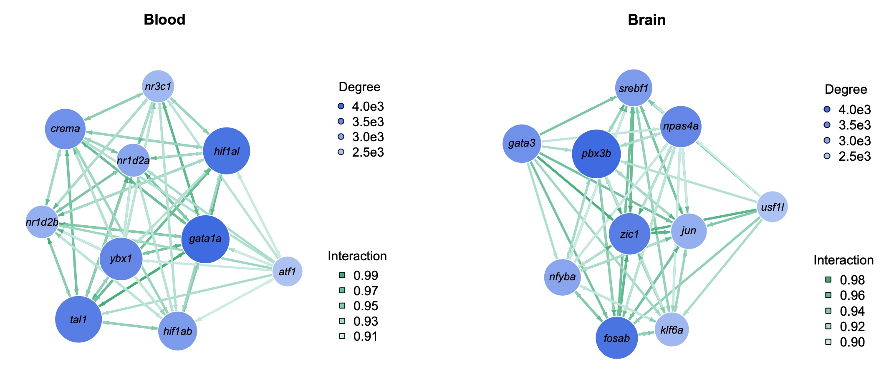
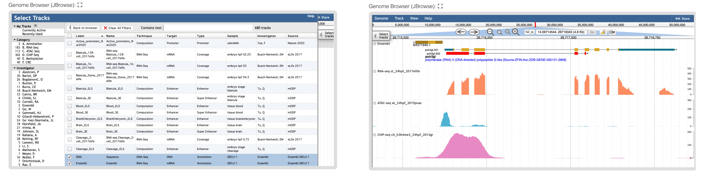
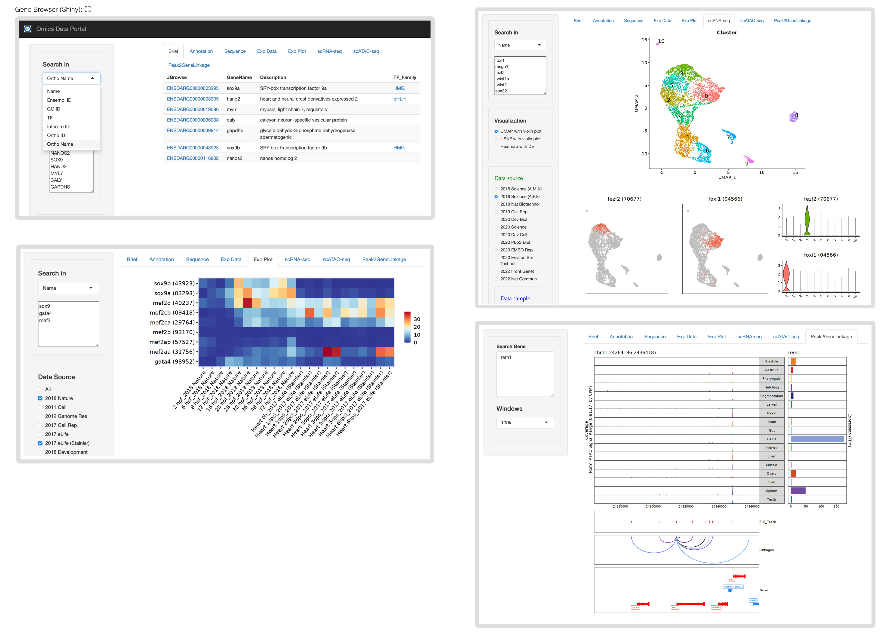
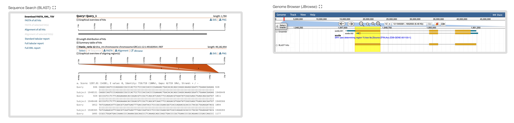

<h1>miniENCODE Analysis Pipeline</h1>

- [Introduction](#introduction)
- [Setup and Installation](#setup-and-installation)
  - [Docker Environment](#docker-environment)
  - [Scripts and Demonstration Files](#scripts-and-demonstration-files)
  - [Running the Docker Container](#running-the-docker-container)
- [Data Analysis](#data-analysis)
  - [Data Download and Preprocessing](#data-download-and-preprocessing)
  - [Data Processing](#data-processing)
    - [Generating the Genome Reference](#generating-the-genome-reference)
    - [RNA-seq](#rna-seq)
    - [ATAC-seq](#atac-seq)
    - [ChIP-seq](#chip-seq)
    - [BS-seq](#bs-seq)
  - [Integrative Analysis](#integrative-analysis)
    - [Define ELS (Enhancer-Like Signature)](#define-els-enhancer-like-signature)
    - [Super Enhancer Prediction](#super-enhancer-prediction)
    - [Gene Regulatory Network (GRN) Prediction](#gene-regulatory-network-grn-prediction)
- [Data Visualization: miniODP](#data-visualization-miniodp)
  - [Genome Browser: JBrowse](#genome-browser-jbrowse)
  - [Gene Browser: Shiny](#gene-browser-shiny)
  - [Sequence Search: SequenceServer](#sequence-search-sequenceserver)
- [Links and Citation](#links-and-citation)


# Introduction

The **ENCODE** project provides a comprehensive map of genomic activity in humans and mice. However, its extensive toolbox can be too costly and technically challenging for smaller research communities. This presents a hurdle for understudied model organisms where resource constraints and complex omics data integration further compound the challenge. 

To bridge this gap, we introduce the **miniENCODE** project, showcasing the zebrafish as a model. We collected, generated, and integrated datasets from three experimental assays (RNA-seq, ATAC-seq, H3K27ac ChIP-seq) across developmental stages and adult tissues. This analysis is facilitated by our newly developed miniODP database, a computational tool designed for the integration and visualization of multi-omics data. Utilizing these methods, we have cataloged over 52,000 candidate enhancers, identified various stage-specific, tissue-specific, and constantly active enhancers, and experimentally validated a subset of heart-specific enhancers. We have delineated key transcription factors and their corresponding regulatory networks across developmental stages and adult tissues. 



`Overview of miniENCODE assays and the miniODP database`

This study not only delivers valuable regulatory insights for the zebrafish research community but also illustrates how an integrative approach can aid in understanding complex regulatory mechanisms even with limited resources. This strategy could empower scientific communities working with various **understudied model organisms** to expedite their genomic research without overstretching their resources.

The **miniENCODE Analysis Pipeline**, presented in this repository, is designed for versatile multi-omics data analysis and was used in our research. It offers a complete set of tools for processing, analyzing, and integrating diverse omics datasets. This pipeline enables the broader scientific community to replicate our study's findings and conduct in-depth genomic research with minimal setup.

The miniENCODE Analysis Pipeline offers two main functions. First, the **processing and analysis** of various omics data types, including RNA-seq, ATAC-seq, ChIP-seq, and BS-seq. This stage also encompasses the integration analysis of three miniENCODE assay data (RNA-seq, ATAC-seq, H3K27ac ChIP-seq), which involves enhancer analysis and the prediction of regulatory networks. Second, the **visualization** of multi-omics data by the miniODP component. 

In this repository, we provide documentation, scripts, a configured running environment, and example files for both data analysis and data visualization. These resources are designed to assist users in effectively utilizing the pipeline for robust genomic research.

# Setup and Installation

The miniENCODE Analysis Pipeline is optimized for use with Docker to ensure a smooth installation process and consistent performance across various systems.

## Docker Environment

Docker creates isolated environments (containers) for applications, promoting consistent operation across different computing environments.

**Getting Started with Docker**:
- Download and install Docker from its [official website](https://www.docker.com/get-started).
- Follow the provided installation guide for your operating system.
- For beginners, the [Docker 101 Tutorial](https://www.docker.com/101-tutorial/) is a useful resource to get acquainted with Docker basics.

**Retrieve the miniENCODE Docker Image** from [dockerhub](https://hub.docker.com/) (Approx. 6.6 GB):
   ```bash
   docker pull qtulab/miniencode
   ```

## Scripts and Demonstration Files

**Cloning the Repository**:
   ```bash
   git clone https://github.com/QTuLab/miniENCODE
   ```

**Download Demo Files**:
- Analysis data: 
  - part1 (3.8GB), from [Tu Lab](https://tulab.genetics.ac.cn/~qtu/miniENCODE/data1.tar.gz) or [Cloud Disk](https://www.jianguoyun.com/p/DYBv6y8QhuDnCBj7-a0FIAA) (MD5 Checksum: `de16dbe53e2a74135ed72846dffc9b3b`)
  - part2 (4.6GB), from [Tu Lab](https://tulab.genetics.ac.cn/~qtu/miniENCODE/data2.tar.gz) or [Cloud Disk](https://www.jianguoyun.com/p/DUOUViIQhuDnCBj9-a0FIAA) (MD5 Checksum: `b358ac53e456f9e5de077db9aa072907`)

- Visualization files (miniODP): 
  - from [Tu Lab](https://tulab.genetics.ac.cn/~qtu/miniENCODE/miniODP.tar.gz) or [Cloud Disk](https://www.jianguoyun.com/p/DVYxz0YQhuDnCBje9q0FIAA) (MD5 Checksum: `01156a353c7a1acfd5838e52363e4bac`)

After downloading, place these files in their respective directories within the cloned repository.

## Running the Docker Container

**Setting Up and Executing the Pipeline**:

1. Define the working path:
   ```bash
   export MiniENCODE_PATH=/path/to/miniENCODE/
   ```

2. To run the analysis pipeline:
   ```bash
   docker run -it -v $MiniENCODE_PATH:/mnt/miniENCODE qtulab/miniencode
   ```

3. To run miniODP for data visualization:
   ```bash
   docker run -it -v $MiniENCODE_PATH:/mnt/miniENCODE \
      -p 80:80 -p 3838:3838 -p 4040:4040 qtulab/miniencode
   # in the container, run the command:
   /bin/bash /mnt/miniENCODE/scripts/miniENCODE_start_docker_service.sh
   ```

Access the services at: `http://<docker-ip>/miniodp`

**Note on Docker Usage**:
- Files within the Docker container are mounted under `/mnt`.
- Pre-configured symbolic links in the Docker image ensure automatic data fetching for miniODP services. For custom data, either replicate the file structure or manually adjust symbolic links according to the Dockerfile instructions.
- The miniODP startup script automatically provides the container's IP and access URL.
- While it's possible to install miniENCODE components individually (refer to the Dockerfile and tool-specific links), using our provided Docker image is recommended for ensuring compatibility and ease of use.

# Data Analysis

## Data Download and Preprocessing

**Public Data Download**: A significant amount of omics data for various species is accessible in public databases like the Sequence Read Archive (SRA). This data is valuable for integrative analysis purposes.

Tools:
- [SRA Toolkit](https://github.com/ncbi/sra-tools/wiki/): For downloading datasets from the SRA.
- [FastQC](https://www.bioinformatics.babraham.ac.uk/projects/fastqc/): For quality control checks on raw sequence data.

Process:
```bash
# Enter the Docker container and navigate to the miniENCODE directory
docker run --rm -it --cpus 4 -v $MiniENCODE_PATH:/mnt/miniENCODE qtulab/miniencode
cd /mnt/miniENCODE

# Modify 'miniENCODE_pre_download_qc.sh' and 'id_download.txt' in 'data/info' with desired SRA IDs
# Estimated Time: ~30 min (varies with data size and network speed)
bash scripts/miniENCODE_pre_download_qc.sh
```

**Data Preprocessing**

Tools:
- [Trim Galore](http://www.bioinformatics.babraham.ac.uk/projects/trim_galore/):  For trimming and quality control of sequence data.

Process:
- Assess the need for trimming based on QC results.
```bash
# Modify the 'miniENCODE_pre_trim_qc.sh' script as required
# Estimated Time: ~5 min
bash scripts/miniENCODE_pre_trim_qc.sh
```

## Data Processing

This section outlines the processes and tools used for various types of data analysis in the miniENCODE project.

### Generating the Genome Reference

Tools:
- [HISAT2](http://daehwankimlab.github.io/hisat2/)
- [Bowtie 2](https://bowtie-bio.sourceforge.net/bowtie2/index.shtml)
- [Bismark](https://github.com/FelixKrueger/Bismark)

Process:
- Example using zebrafish genome GRCz11 chromosome 1.
- Reference Files Required:
  - `data/reference/GRCz11_chr1_dna.fa`
  - `data/reference/GRCz11_chr1_100.gtf`

```bash
# Modify 'miniENCODE_pre_makeRef.sh' script as needed
# Estimated Time: ~5 min
bash scripts/miniENCODE_pre_makeRef.sh
```

### RNA-seq

Purpose:
- Sequence alignment, data merging, and transcription level quantification.

Tools:
- [HISAT2](http://daehwankimlab.github.io/hisat2/)
- [SAMtools](https://github.com/samtools/)
- [deepTools](https://github.com/deeptools/deepTools)
- [StringTie](https://ccb.jhu.edu/software/stringtie/)

Process:
- Demonstration focuses on chromosome 1
```bash
# Update 'miniENCODE_pre_RNA.sh' script, SRA IDs in 'data/info/id_rna.txt', and group info in 'data/info/namelist_rna.csv'
# Estimated Time: 5 min
bash scripts/miniENCODE_pre_RNA.sh
```

### ATAC-seq

Purpose:
- Sequence alignment and peak calling.

Tools:
- [Bowtie 2](https://bowtie-bio.sourceforge.net/bowtie2/index.shtml)
- [SAMtools](https://github.com/samtools/)
- [Picard](https://broadinstitute.github.io/picard/)
- [deepTools](https://github.com/deeptools/deepTools)
- [MACS](https://github.com/macs3-project/MACS/)

Process:
- Demonstration focuses on chromosome 1
```bash
# Update 'miniENCODE_pre_ATAC.sh' script, SRA IDs in 'data/info/id_atac.txt' and group information in 'data/info/namelist_atac.csv'
# Estimated Time: 10 min
bash scripts/miniENCODE_pre_ATAC.sh
```

### ChIP-seq

Purpose:
- Sequence alignment and peak calling.

Tools:
- [Bowtie 2](https://bowtie-bio.sourceforge.net/bowtie2/index.shtml)
- [SAMtools](https://github.com/samtools/)
- [Picard](https://broadinstitute.github.io/picard/)
- [deepTools](https://github.com/deeptools/deepTools)
- [MACS](https://github.com/macs3-project/MACS/)

Process:
- Demonstration focuses on chromosome 1
```bash
# Update the 'miniENCODE_pre_ChIP.sh' script, SRA IDs in 'data/info/id_chip.txt' and group information in 'data/info/namelist_chip.csv'
# Estimated Time: 5 min
bash scripts/miniENCODE_pre_ChIP.sh
```

### BS-seq

Purpose:
- Sequence alignment

Tools:
- [Bismark](https://github.com/FelixKrueger/Bismark)
- [SAMtools](https://github.com/samtools/)
- [deepTools](https://github.com/deeptools/deepTools)

Process:
- Demonstration focuses on chromosome 1
```bash
# Update the 'miniENCODE_pre_BS.sh' script, SRA IDs in 'data/info/id_bs.txt' and group information in 'data/info/namelist_bs.csv'
# Estimated Time: 5 min
bash scripts/miniENCODE_pre_BS.sh
```

## Integrative Analysis

This section details the steps and tools used for the integrative analysis within the miniENCODE project, focusing on defining enhancer-like signatures (ELS), predicting super-enhancers, and constructing gene regulatory networks (GRN).

### Define ELS (Enhancer-Like Signature)



`Genomic view of ELSs across tissues supported by multi-omics data`

Reference Files:
- `data/reference/GRCz11_TSS_Basic.bed`
- `data/reference/GRCz11_TSS_Basic4K.bed`

Demo Input Files (ATAC-seq and H3K27ac-seq data for Blastula and Blood stages):
- `data/ELS/atac_peaks.bed`
- `data/ELS/Blastula/ATAC_Blastula.bam.bw`
- `data/ELS/Blastula/H3K27ac_Blastula.bam.bw`
- `data/ELS/Blood/ATAC_Blood.bam.bw`
- `data/ELS/Blood/H3K27ac_Blood.bam.bw`

```bash
# ELS Analysis Demonstration: 
# Process DNA accessibility regions to obtain 'rDAR_final.bed'
# Estimated Time: ~50 min
bash scripts/miniENCODE_ELS_rDAR.sh

# Analysis for Blastula and Blood stages
# Estimated Time: 3 min each
bash scripts/miniENCODE_ELS_zscore.sh
bash scripts/miniENCODE_ELS_classifyELS.sh
```

### Super Enhancer Prediction



`Genomic view of multiple super-enhancers`

Tools:
- [ROSE](https://github.com/younglab/ROSE)

Process:
- Genome Reference File: `data/reference/GRCz11_ucsc.refseq`
- Demo Input Files:
  - `data/alignment/ch_H3K27ac_heart_2020nat_chr1.final.bam`
  - `data/alignment/ch_input_heart_2020nat_chr1.final.bam`
```bash
# Modify the 'miniENCODE_SE.sh' script
# Estimated Time: 5 min
bash scripts/miniENCODE_SE.sh
```

### Gene Regulatory Network (GRN) Prediction



`Tissue-specific enhancer-gene regulatory sub-networks for blood and brain tissues`

Tools:
- [GimmeMotifs](https://gimmemotifs.readthedocs.io/en/master/)
- [ANANSE](https://github.com/vanheeringen-lab/ANANSE)

Process:
- Demo Input Files:
  - `data/GRN/input/at_Blood_chr1.bam`
  - `data/GRN/input/ch_H3K27ac_Blood_chr1.bam`
  - `data/GRN/input/els_Blood_chr1.bed`
  - `data/GRN/input/tpm_Blood.txt`
- Zebrafish TFs Binding Motifs File: `data/reference/GRCz11_TFDB/danRer11.gimme.vertebrate.v5.0.pfm`
```bash
# GRN Analysis
# Estimated Time: 15 min
bash scripts/miniENCODE_GRN.sh
```

# Data Visualization: miniODP

Users can instantly set up a functional miniODP platform by running the Docker using the provided command. For those who prefer to host it on their own server, we've included detailed instructions for the installation process and for adding data.

## Genome Browser: JBrowse



`Genome browser, equipped with a sophisticated track selector, allows visualization of diverse omics data tracks`

Tools:
- [JBrowse](https://jbrowse.org/jbrowse1.html)

Process:
- Install the Apache2 and JBrowse.
```bash
sudo apt-get install apache2 apache2-utils build-essential zlib1g-dev

# Download a JBrowse release from GitHub
curl -L -O https://github.com/GMOD/jbrowse/releases/download/1.16.11-release/JBrowse-1.16.11.zip
unzip JBrowse-1.16.11.zip
sudo mv JBrowse-1.16.11 /var/www/html/jbrowse
cd /var/www/html/jbrowse
./setup.sh
```
- Add BigWig (bw) files and BED files (e.g., `jbrowse/data/Danio_rerio/pub/ch_h3k27ac_24hpf_2012gr_dedup.bam.bw`)  to JBrowse for visualization.
- Create the track files for the BED files using `/var/www/html/jbrowse/bin/flatfile-to-json.pl`.
- Configure parameters in the `jbrowse/data/Danio_rerio/tracks.conf` and `jbrowse/data/Danio_rerio/trackList.json` files for the associated data.
- Update the relevant information in the `jbrowse/data/Danio_rerio/MetaData.csv` file.

## Gene Browser: Shiny



`Gene browser for querying gene-specific annotations and visualizing gene expression patterns, including single-cell RNA-seq and multi-omics data`

Tools:
- [Shiny](https://www.rstudio.com/products/shiny/)
- [ShinyProxy](https://www.shinyproxy.io/) (optional)

Process:
- Install Java, Docker, Shiny, and ShinyProxy.
```bash
# Install Java
sudo add-apt-repository ppa:deadsnakes/ppa
sudo apt-get update  && \
     apt-get install -y openjdk-11-jdk-headless

# Install Docker
sudo apt-get update && apt-get install -y \
     apt-transport-https ca-certificates \
     curl gnupg-agent software-properties-common
curl -fsSL https://download.docker.com/linux/ubuntu/gpg | sudo apt-key add -
sudo add-apt-repository "deb [arch=amd64] https://download.docker.com/linux/ubuntu $(lsb_release -cs) stable"
sudo apt-get update && apt-get install -y docker-ce docker-ce-cli containerd.io

# Setting docker start options
sudo mkdir -p /etc/systemd/system/docker.service.d/
sudo echo -e '[Service]\nExecStart=\nExecStart=/usr/bin/dockerd -H unix:// -D -H tcp://127.0.0.1:2375' > /etc/systemd/system/docker.service.d/override.conf

# Install ShinyProxy
sudo docker pull openanalytics/shinyproxy-demo
wget https://www.shinyproxy.io/downloads/shinyproxy_3.0.2_amd64.deb
sudo dpkg -i shinyproxy_3.0.2_amd64.deb
# Check status
sudo systemctl status shinyproxy
```
- Create a base Shiny docker image with `docker/ShinyProxy_base/Dockerfile`
- Configure the settings in the `/etc/shinyproxy/application.yml`.
- Import RNA-seq TPM (Transcripts Per Million) data frame into `miniODP/mODP_zebrafish/lib/expdb/ExpDB_pub.sqlite`.
- Add the single-cell data and complete the `app.R` file.
- Integrate and display data in the Shiny App.

## Sequence Search: SequenceServer



`BLAST server for sequence search. BLAST results link back to the genome browser, which enables the user to interpret BLAST search results in the genomic context`

Tools:
- [SequenceServer](https://sequenceserver.com/)
- [BLAST](https://blast.ncbi.nlm.nih.gov/Blast.cgi)

Process:
- Install the BLAST and SequenceServer.
```bash
sudo apt-get install ncbi-blast+
sudo gem install sequenceserver
```
- Configure the settings in the `/etc/sequenceserver.conf`.
- Create a reference database in `/db/blastdb/` using `makeblastdb`.

# Links and Citation

For further information and resources related to the miniENCODE project, please refer to the following links:

- [miniODP](https://tulab.genetics.ac.cn/miniodp/): for accessing zebrafish and medaka multi-omics datasets currently hosted on the platform.
- [miniENCODE@github](https://github.com/QTuLab/miniENCODE): for detailed documentation and the necessary code to set up your own miniENCODE analysis pipeline.

